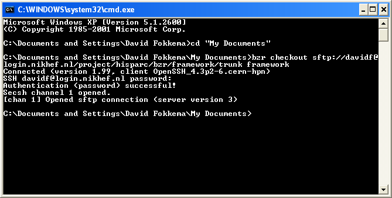

.. include:: subst.inc

Installation of the |hisparc| framework
=======================================

The |hisparc| framework is a `Python <http://www.python.org/>`_ package
which only deals with the HiSPARC data and leaves general things like data
storage and plotting to other modules.  Therefore, you'll need to install
Python and several libraries before you can use the framework.
Furthermore, due to the fact that the framework is still in early alpha
and development happens in a quick pace, there are no code releases yet.
Of course, you can grab the sources from the source repository, which is
in Bazaar, but only if you have a Nikhef login.  If not, you can contact
`David Fokkema <davidf@nikhef.nl>`_ to obtain a code dump.  We'll work
towards code releases and a website with issue tracker.

Currently, the instructions are for Ubuntu Linux and Microsoft Windows.
If you want to submit instructions for other platforms, you're very
welcome to do so.  If you find errors or omissions, please inform us so we
can update the documentation!

Prerequisites
-------------

The following is just an overview of prerequisites.  Don't worry, the
installation instructions in the following sections will show that it's
not that hard to install everyting.

You'll need to have the following installed in order to make use of the
|hisparc| framework:

`Python 2.6 <http://www.python.org/>`_
    The Python programming language

`NumPy <http://numpy.scipy.org/>`_
    A fundamental package needed for scientific computing with Python

`SciPy <http://scipy.org/>`_
    A software package for mathematics, science, and engineering

`Matplotlib <http://matplotlib.sourceforge.net/>`_
    A Python 2D plotting library which produces publication quality
    figures

`PyTables <http://www.pytables.org/>`_
    A package for managing hierarchical datasets and designed to
    efficiently and easily cope with extremely large amounts of data

`HDF5 <http://hdfgroup.org/HDF5/>`_
    A data model, library, and file format for storing and managing data.
    It supports an unlimited variety of datatypes, and is designed for
    flexible and efficient I/O and for high volume and complex data.

And, preferably:

`IPython <http://ipython.scipy.org/>`_
    An enhanced interactive Python shell, providing a comprehensive
    environment for interactive and exploratory computing

To be able to download and track the framework sources yourself and
optionally take part in development, you'll need:

`Bazaar <http://bazaar-vcs.org/>`_
    a distributed version control system that adapts to the way you want
    to work

Installation in Ubuntu Linux 10.10, the *Maverick Meerkat*
----------------------------------------------------------

Installation in any Linux distribution is rather painless. Especially in
Debian-based distributions, like Ubuntu, it is as easy as opening a
terminal and typing::

    $ sudo apt-get install bzr ipython python-scipy python-matplotlib python-tables

Getting the framework sources
^^^^^^^^^^^^^^^^^^^^^^^^^^^^^

For checking out the framework sources, navigate to the desired location
and issue::

    $ bzr checkout sftp://<loginname>@login.nikhef.nl/project/hisparc/bzr/framework/trunk framework

Installation in Microsoft Windows XP
------------------------------------

Installation in Windows has become a *lot* easier now that `Python(x,y)
<http://pythonxy.com/>`_ has become a mature software package.  You'll
need to download and install the following packages:

`Python (x,y) <http://www.pythonxy.com/>`_
    An easy-to-use installer which includes Python, Eclipse and numerous
    libraries for scientific use.  **Make sure the NumPy, SciPy,
    Matplotlib and PyTables packages are selected.**  These are all
    selected by default.

`Bazaar <http://bazaar-vcs.org/>`_
    a distributed version control system that adapts to the way you want
    to work. Make sure to download the **Standalone** installer.

Getting the framework sources
^^^^^^^^^^^^^^^^^^^^^^^^^^^^^

Open a command window and navigate to the *My documents* folder, or any
other folder in which you want to install the framework.  Then, issue::

    bzr checkout sftp://<loginname>@login.nikhef.nl/project/hisparc/bzr/framework/trunk framework

   A screenshot showing a command window with a bzr checkout just issued.

General usage of the framework in Python scripts
------------------------------------------------

To use the |hisparc| framework from a python script, make sure the source
path is in your python path, like so::

    import sys
    sys.path.append('/path/to/framework')

Or, alternatively, you can add the path to the $PYTHONPATH environment
variable.  If you know how to do this, this will be the easier option.

It is also possible, although not recommended for anything more serious
than casual testing, to put scripts in the framework directory itself, but
above the *hisparc* folder.  When running them from this directory, you
don't need to explicitly set up your paths.  Problems might arise when you
try to update the framework sources.

Some examples
-------------

To quickly run some examples, navigate to the framework directory and
start ``ipython -pylab``.  Then, just issue one of the following lines::

    >>> %run -i examples/sciencepark.py
    >>> %run -i examples/kvi.py

More examples are available in the examples/ subdirectory.
