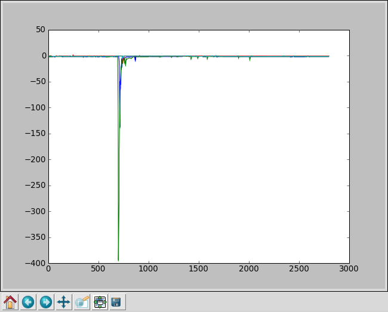

.. include:: subst.inc

Replay of the introductory session (September 7th, 2009)
========================================================

.. note::

   This is old.  It can only give you an overview of the sort of things
   you can do.  For correct examples, look at the examples/ subdirectory
   or read the function reference.

On Monday, September 7th, 2009 David gave a short introduction to *python*,
*matplotlib* (with its *pylab* interface) and what is to become the
*HiSPARC framework*.  Currently, the "framework" only consists of a
small collection of scripts, but its interface is remarkably easy to use
from an advanced python shell like *IPython*.

.. note::

   This log was generated using an outdated version of the framework.  If
   you want to run these exact examples, be sure to revert to revision 21,
   like so::

        $ bzr revert -r 21

   Please see the :doc:`install` for more information.

To use IPython with all the power of data visualization, invoke it with
the *-pylab* option, like so::

    $ ipython -pylab

That will save you a bunch of import statements.  First, just to show you
how easy it is to plot sin(x)::

    >>> x = linspace(-2 * pi, 2 * pi)
    >>> y = sin(x)
    >>> plot(x,y)
    [<matplotlib.lines.Line2D object at 0xa394e6c>]

That's easy, right? The contents of ``x`` and ``y`` are arrays::

    >>> x
    array([ -6.28318531e+00,  -5.89048623e+00,  -5.49778714e+00,
            -5.10508806e+00,  -4.71238898e+00,  -4.31968990e+00,
            -3.92699082e+00,  -3.53429174e+00,  -3.14159265e+00,
            -2.74889357e+00,  -2.35619449e+00,  -1.96349541e+00,
            -1.57079633e+00,  -1.17809725e+00,  -7.85398163e-01,
            -3.92699082e-01,   7.10542736e-15,   3.92699082e-01,
             7.85398163e-01,   1.17809725e+00,   1.57079633e+00,
             1.96349541e+00,   2.35619449e+00,   2.74889357e+00,
             3.14159265e+00,   3.53429174e+00,   3.92699082e+00,
             4.31968990e+00,   4.71238898e+00,   5.10508806e+00,
             5.49778714e+00,   5.89048623e+00,   6.28318531e+00])
    >>> y
    array([  2.44921271e-16,   3.82683432e-01,   7.07106781e-01,
             9.23879533e-01,   1.00000000e+00,   9.23879533e-01,
             7.07106781e-01,   3.82683432e-01,  -3.67517431e-15,
            -3.82683432e-01,  -7.07106781e-01,  -9.23879533e-01,
            -1.00000000e+00,  -9.23879533e-01,  -7.07106781e-01,
            -3.82683432e-01,   7.10542736e-15,   3.82683432e-01,
             7.07106781e-01,   9.23879533e-01,   1.00000000e+00,
             9.23879533e-01,   7.07106781e-01,   3.82683432e-01,
            -1.05356804e-14,  -3.82683432e-01,  -7.07106781e-01,
            -9.23879533e-01,  -1.00000000e+00,  -9.23879533e-01,
            -7.07106781e-01,  -3.82683432e-01,   1.39659334e-14])

Now, we'll import the |hisparc| framework (well, just a small part of it)
and show that it's easy to get help from inside a python shell::

    >>> import hisparc
    >>> help(hisparc)
    Help on package hisparc:

    NAME
        hisparc - HiSPARC Framework

    FILE
        /media/eeebuntu/home/david/work/HiSPARC/software/bzr/framework/hisparc/__init__.py

    DESCRIPTION
        This collection of scripts intends to be useful for all aspects of
        HiSPARC data analysis.
        
        At the moment, it is nothing like a *real* framework, but hopefully,
        someday...
        
        The following packages and modules are included:
        
        :mod:`~hisparc.analysis`
            all modules related to reconstruction and analysis
        
        :mod:`~hisparc.eventwarehouse`
            a module to fetch data from the eventwarehouse
        
        :mod:`~hisparc.gpstime`
            a module to convert GPS to UTC times and vice versa
        
        :mod:`~hisparc.kascade`
            a module to get data from KASCADE and search for coincidences
            between HiSPARC and KASCADE
        
        :mod:`~hisparc.utils`
            a collection of modules to make life easy

    PACKAGE CONTENTS
        analysis (package)
        eventwarehouse
        gpstime
        kascade
        utils (package)

You can call the ``help`` function on any python object.  The help message
that's displayed to you is embedded in the source code of the modules and
functions and is used for autogenerated help (like shown above), online
manuals (in HTML) and offline manuals (using LaTeX, a PDF file can be
produced).  The embedded messages are called *docstrings*.  You're
currently reading this either in HTML or PDF form and the above docstring
is also included in the documentation you are currently reading.

Now, let's download some detector data (from station 601, located at
|kascade| in Karlsruhe, Germany)::

    >>> from hisparc.utils import download_data
    >>> download_data.start_download('mydata.h5', limit=10)
    Creating a new PyTables data file...  done.
    Starting subprocesses...
    Downloading 5000 events, starting from offset 0... 
    Waiting for subprocesses to shut down...
    Time window:  2008-07-01 14:29:45 2008-07-01 14:52:44
    done.
    Putting events in queue...
    Downloading 5000 events, starting from offset 5000... 
    Processing events... 
    Time window:  2008-07-01 14:52:44 2008-07-01 15:15:18
    done.
    done.
    Putting events in queue...
    Downloading 5000 events, starting from offset 10000... 
    Processing events... 
    Time window:  2008-07-01 15:15:18 2008-07-01 15:38:13
    done.
    done.
    Putting events in queue...
    Downloading 5000 events, starting from offset 15000... 
    Processing events... 
    Time window:  2008-07-01 15:38:13 2008-07-01 16:01:34
    done.
    done.
    Putting events in queue...
    Downloading 5000 events, starting from offset 20000... 
    Processing events... 
    Time window:  2008-07-01 16:01:35 2008-07-01 16:24:28
    done.
    done.
    Putting events in queue...
    Downloading 5000 events, starting from offset 25000... 
    Processing events... 
    Time window:  2008-07-01 16:24:29 2008-07-01 16:47:25
    done.
    done.
    Putting events in queue...
    Downloading 5000 events, starting from offset 30000... 
    Processing events... 
    Time window:  2008-07-01 16:47:25 2008-07-01 17:10:27
    done.
    done.
    Putting events in queue...
    Downloading 5000 events, starting from offset 35000... 
    Processing events... 
    Time window:  2008-07-01 17:10:28 2008-07-01 17:36:01
    done.
    done.
    Putting events in queue...
    Downloading 5000 events, starting from offset 40000... 
    Processing events... 
    Time window:  2008-07-01 17:36:01 2008-07-01 17:56:59
    done.
    done.
    Putting events in queue...
    Downloading 5000 events, starting from offset 45000... 
    Processing events... 
    Time window:  2008-07-01 17:56:59 2008-07-01 18:19:38
    done.
    done.
    Putting events in queue...
    Limit reached, shutting down.
    Processing events... 
    done.
    No more events, shutting down.

This created two subprocesses which were downloading and processing the
data in chunks of 5000 events.  The results are stored on disk in the
specified filename.  To access it, you need the :mod:`pytables` module::

    >>> import tables
    >>> data = tables.openFile('mydata.h5', 'a')

Let's print some information on the structure of this file::

    >>> print(data)
    mydata.h5 (File) 'HiSPARC / KASCADE data'
    Last modif.: 'Fri Sep 11 21:34:04 2009'
    Object Tree: 
    / (RootGroup) 'HiSPARC / KASCADE data'
    /coincidences (Group) 'HiSPARC / KASCADE coincidences'
    /coincidences/events (Table(0,)) 'Coincidence events'
    /hisparc (Group) 'HiSPARC data'
    /hisparc/events (Table(50000,)) 'HiSPARC events'
    /hisparc/traces (VLArray(199984,)) 'HiSPARC event traces'
    /kascade (Group) 'KASCADE data'
    /kascade/events (Table(0,)) 'KASCADE events'

...and of a single event::
    >>> data.root.hisparc.events[0]
    (32902693L, 1214922585, 524607482L, 1214922585524607488L, [3, 2, -9999, -9999], [0, 0, -9999, -9999], [0, 1, -1, -1])

Ok, not very helpful (just numbers, right?). Let's look at their meaning::

    >>> data.root.hisparc.events
    /hisparc/events (Table(50000,)) 'HiSPARC events'
      description := {
      "event_id": UInt64Col(shape=(), dflt=0, pos=0),
      "timestamp": Time32Col(shape=(), dflt=0, pos=1),
      "nanoseconds": UInt32Col(shape=(), dflt=0, pos=2),
      "ext_timestamp": UInt64Col(shape=(), dflt=0, pos=3),
      "pulseheights": Int16Col(shape=(4,), dflt=-9999, pos=4),
      "integrals": Int32Col(shape=(4,), dflt=-9999, pos=5),
      "traces": Int32Col(shape=(4,), dflt=-1, pos=6)}
      byteorder := 'little'
      chunkshape := (128,)

This shows us the columns in the data set and gives some meaning to those
numbers.  Now, let's import another submodule, :mod:`hisparc.kascade` and
use that to fetch the |kascade| data corresponding to our |hisparc| data
set::

    >>> import hisparc.kascade
    >>> hisparc.kascade.helper(data.root.hisparc.events, data.root.kascade.events, 'kascade.dat.gz')
    Processing data from Tue Jul  1 16:29:31 2008 to Tue Jul  1 20:19:24 2008

And the structure of the |kascade| event table::

    >>> data.root.kascade.events
    /kascade/events (Table(3284,)) 'KASCADE events'
      description := {
      "run_id": Int32Col(shape=(), dflt=0, pos=0),
      "event_id": Int64Col(shape=(), dflt=0, pos=1),
      "timestamp": Time32Col(shape=(), dflt=0, pos=2),
      "nanoseconds": UInt32Col(shape=(), dflt=0, pos=3),
      "ext_timestamp": UInt64Col(shape=(), dflt=0, pos=4),
      "energy": Float64Col(shape=(), dflt=0.0, pos=5),
      "core_pos": Float64Col(shape=(2,), dflt=0.0, pos=6),
      "zenith": Float64Col(shape=(), dflt=0.0, pos=7),
      "azimuth": Float64Col(shape=(), dflt=0.0, pos=8),
      "Num_e": Float64Col(shape=(), dflt=0.0, pos=9),
      "Num_mu": Float64Col(shape=(), dflt=0.0, pos=10),
      "dens_e": Float64Col(shape=(4,), dflt=0.0, pos=11),
      "dens_mu": Float64Col(shape=(4,), dflt=0.0, pos=12),
      "P200": Float64Col(shape=(), dflt=0.0, pos=13),
      "T200": Float64Col(shape=(), dflt=0.0, pos=14)}
      byteorder := 'little'
      chunkshape := (49,)

Now we want to analyse this data set and search for coincidences between
|kascade| and |hisparc| (the reason for placing a detector station at the
|kascade| site).  We'll run the
:func:`hisparc.analysis.kascade_coincidences.test` function to test if we
actually have coincidences::

    >>> import hisparc.analysis.kascade_coincidences as coinc
    >>> coinc.test(data)
    Careful: the following search is limited to 1000 kascade events
    The complete statement would be:
    c = do_timeshifts(data, [-13.180213654])
    Calculating dt's for timeshift -13.180213654 (-13180213654 nanoseconds)

We were actually shifting the |hisparc| data -13.18 seconds back in time.
Why?  That's because of the fact that |kascade| uses UTC, whereas |hisparc|
uses GPS time.  Learn more by googling for *UTC GPS leap seconds*.  The
plot above shows a perfect match.  When you don't get the timeshifts
entirely right, you get something like::

    >>> c = coinc.do_timeshifts(data, [-14, -13, -12])
    Calculating dt's for timeshift -14.000000000 (-14000000000 nanoseconds)
    Calculating dt's for timeshift -13.000000000 (-13000000000 nanoseconds)
    Calculating dt's for timeshift -12.000000000 (-12000000000 nanoseconds)

Or, even worse::

    >>> c = coinc.do_timeshifts(data, [0, 1, 2, 3, -15])
    Calculating dt's for timeshift 0.000000000 (0 nanoseconds)
    Calculating dt's for timeshift 1.000000000 (1000000000 nanoseconds)
    Calculating dt's for timeshift 2.000000000 (2000000000 nanoseconds)
    Calculating dt's for timeshift 3.000000000 (3000000000 nanoseconds)
    Calculating dt's for timeshift -15.000000000 (-15000000000 nanoseconds)

You can really see that the time difference between |kascade| and |hisparc|
events is just a Poisson distribution (i.e. a random distribution, proving
that we *don't* see coincidences with these time shifts).

Now, let's get the entire set of coincidences and store it in the ``c``
variable::

    >>> c = coinc.do_timeshifts(data, [-13.180213654])
    Calculating dt's for timeshift -13.180213654 (-13180213654 nanoseconds)
    >>> len(c)
    3280
    >>> c[0]
    (-662L, 17, 0)
    >>> c[1]
    (-406L, 58, 1)

The first column above is the residual time difference between the events
in nanoseconds and the second and third column are pointers into the
|hisparc| and |kascade| data sets respectively.

Let's store the coincidences in the file and look at the table structure::

    >>> coinc.store_coincidences(data, c)
    >>> data.root.coincidences.events
    /coincidences/events (Table(3280,)) 'Coincidence events'
      description := {
      "hisparc_event_id": UInt64Col(shape=(), dflt=0, pos=0),
      "kascade_event_id": UInt64Col(shape=(), dflt=0, pos=1),
      "hisparc_timestamp": Time32Col(shape=(), dflt=0, pos=2),
      "hisparc_nanoseconds": UInt32Col(shape=(), dflt=0, pos=3),
      "hisparc_ext_timestamp": UInt64Col(shape=(), dflt=0, pos=4),
      "hisparc_pulseheights": Int16Col(shape=(4,), dflt=-9999, pos=5),
      "hisparc_integrals": Int32Col(shape=(4,), dflt=-9999, pos=6),
      "hisparc_traces": Int32Col(shape=(4,), dflt=-1, pos=7),
      "kascade_timestamp": Time32Col(shape=(), dflt=0, pos=8),
      "kascade_nanoseconds": UInt32Col(shape=(), dflt=0, pos=9),
      "kascade_ext_timestamp": UInt64Col(shape=(), dflt=0, pos=10),
      "kascade_energy": Float64Col(shape=(), dflt=0.0, pos=11),
      "kascade_core_pos": Float64Col(shape=(2,), dflt=0.0, pos=12),
      "kascade_zenith": Float64Col(shape=(), dflt=0.0, pos=13),
      "kascade_azimuth": Float64Col(shape=(), dflt=0.0, pos=14),
      "kascade_Num_e": Float64Col(shape=(), dflt=0.0, pos=15),
      "kascade_Num_mu": Float64Col(shape=(), dflt=0.0, pos=16),
      "kascade_dens_e": Float64Col(shape=(4,), dflt=0.0, pos=17),
      "kascade_dens_mu": Float64Col(shape=(4,), dflt=0.0, pos=18),
      "kascade_P200": Float64Col(shape=(), dflt=0.0, pos=19),
      "kascade_T200": Float64Col(shape=(), dflt=0.0, pos=20)}
      byteorder := 'little'
      chunkshape := (36,)
    >>> c = data.root.coincidences.events
    >>> c[0]
    (32902710L, 320050L, 1214922591, 700221339L, 1214922591700221440L, [238, 688, 36, 7], [2754, 10815, 183, 7], [54, 55, 56, 57], 1214922578, 520008400L, 1214922578520008448L, 4643070000000000.0, [47.241900000000001, -59.258400000000002], 0.67979599999999996, 0.52411099999999999, 132578.0, 21771.200000000001, [1.4266399999999999, 1.2613300000000001, 1.1405000000000001, 1.2308699999999999], [0.0124371, 0.0120819, 0.0117941, 0.0120118], 31.180399999999999, 1000.3)

To get just one column from the data set and do something useful with it,
we can simply do::

    >>> c[0]['kascade_energy']
    4643070000000000.0

Of course, we want to operate on entire data sets, like this::

    >>> e = [x['kascade_energy'] for x in c]
    >>> len(e)
    3280

Look up *list comprehensions* in the python documentation if you didn't
understand the code shown above.  Let's make a histogram, which is as easy
as::

    >>> hist(e, bins=50)
    (array([2752,  278,   91,   65,   25,   13,   14,    9,    8,    7,    3,
              0,    1,    0,    0,    1,    2,    2,    0,    0,    3,    0,
              0,    0,    0,    0,    1,    1,    0,    0,    0,    0,    0,
              0,    1,    0,    1,    0,    0,    0,    0,    0,    0,    0,
              0,    0,    0,    0,    1,    1]), array([  1.09067000e+14,   1.95614566e+15,   3.80322432e+15,
             5.65030298e+15,   7.49738164e+15,   9.34446030e+15,
             1.11915390e+16,   1.30386176e+16,   1.48856963e+16,
             1.67327749e+16,   1.85798536e+16,   2.04269323e+16,
             2.22740109e+16,   2.41210896e+16,   2.59681682e+16,
             2.78152469e+16,   2.96623256e+16,   3.15094042e+16,
             3.33564829e+16,   3.52035615e+16,   3.70506402e+16,
             3.88977189e+16,   4.07447975e+16,   4.25918762e+16,
             4.44389548e+16,   4.62860335e+16,   4.81331122e+16,
             4.99801908e+16,   5.18272695e+16,   5.36743481e+16,
             5.55214268e+16,   5.73685055e+16,   5.92155841e+16,
             6.10626628e+16,   6.29097414e+16,   6.47568201e+16,
             6.66038988e+16,   6.84509774e+16,   7.02980561e+16,
             7.21451347e+16,   7.39922134e+16,   7.58392921e+16,
             7.76863707e+16,   7.95334494e+16,   8.13805280e+16,
             8.32276067e+16,   8.50746854e+16,   8.69217640e+16,
             8.87688427e+16,   9.06159213e+16,   9.24630000e+16]), <a list of 50 Patch objects>)

.. image:: fig/hist-e.png

Alas, not very useful on this scale.  Plotting the log of the energy
instead::

    >>> e = [log10(x) for x in e]
    >>> hist(e, bins=50)
    (array([ 28,  55,  81, 108, 172, 146, 172, 194, 177, 201, 180, 158, 172,
           128, 135, 131, 114, 109,  95,  95,  77,  78,  51,  65,  51,  41,
            44,  27,  33,  22,  34,  25,  12,   8,  16,   7,   9,  10,   4,
             0,   1,   3,   2,   3,   0,   2,   0,   2,   0,   2]), array([ 14.03769337,  14.09625886,  14.15482435,  14.21338984,
            14.27195534,  14.33052083,  14.38908632,  14.44765181,
            14.50621731,  14.5647828 ,  14.62334829,  14.68191378,
            14.74047927,  14.79904477,  14.85761026,  14.91617575,
            14.97474124,  15.03330674,  15.09187223,  15.15043772,
            15.20900321,  15.2675687 ,  15.3261342 ,  15.38469969,
            15.44326518,  15.50183067,  15.56039617,  15.61896166,
            15.67752715,  15.73609264,  15.79465814,  15.85322363,
            15.91178912,  15.97035461,  16.0289201 ,  16.0874856 ,
            16.14605109,  16.20461658,  16.26318207,  16.32174757,
            16.38031306,  16.43887855,  16.49744404,  16.55600953,
            16.61457503,  16.67314052,  16.73170601,  16.7902715 ,
            16.848837  ,  16.90740249,  16.96596798]), <a list of 50 Patch objects>)

Let's look at the traces stored in the coincidences table::

    >>> c[0]['hisparc_traces']
    array([54, 55, 56, 57])
    >>> traces = data.root.hisparc.traces[54:58]
    >>> len(traces)
    4
    >>> traces[0]
    'x\x9c\xcdZ[v\xeb0\x08\xdc\x90>\xacG\x9cx\xff\x1b+Nr\xcf\xcd\xa1< <snip>

Oops, that's just a binary string, because of compression.  If we
decompress it, we get::

    >>> from zlib import decompress
    >>> traces = [decompress(x) for x in traces]
    >>> traces[0]
    '204,204,204,204,204,204,204,204,204,204,204,204,204,204,204,203, <snip>

Again, a string.  To convert that to a list of integers and then perform
the ADC values to mV conversion using some list comprehension magic and
plot all the traces, we simply type::

    >>> for trace in traces:
    ...     plot([(int(x) - 200) * -0.57 for x in trace.split(',')[:-1]])
    ...     
    [<matplotlib.lines.Line2D object at 0xada742c>]
    [<matplotlib.lines.Line2D object at 0xabd7ccc>]
    [<matplotlib.lines.Line2D object at 0xabe32ec>]
    [<matplotlib.lines.Line2D object at 0xabea14c>]

And, zoomed in using the tool tips at the bottom of plot window:

Now, on for some analysis, we analyse a subset of the coincidences and
reconstruct the shower angle, like this (the plots are of a larger data set
than obtained with the download at the top of this page)::

    >>> import hisparc.analysis.angles as angles
    >>> angles.angle_graphs(data, data.root.coincidences.events, 100, .9)

This concludes our little demonstration.
