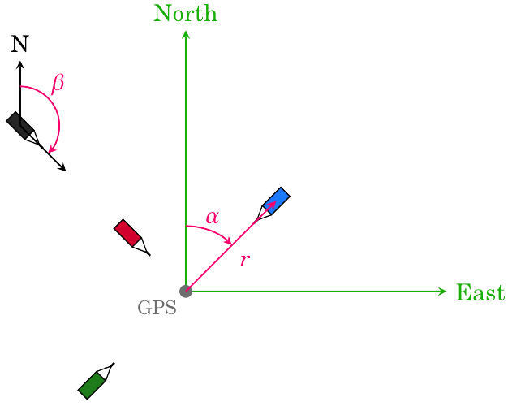

.. include:: subst.inc

HiSPARC station layout
======================

Each |hisparc| station has a GPS antenne and either 2 or 4 scintillator
detectors. This GPS is used to determine the exact location of the
station. However, the GPS is often not at the center of the station,
moreover, not all stations are oriented the same way, and the distances
between detector may differ. For reconstruction of the measured data it
is important to know the location of each detector, this section
explains how the location of the detectors can be measured and
communicated to us.

Compass coordinates
-------------------

The coordinate system we have chosen for describing the position of
detectors is illustrated in the following figure.

For each detector 3 (or 4) coordinates need to be determined:

- First the distance (:code:`r`) from the GPS to the center of the
  scintillator (in meters).
- Next the alpha angle (:code:`α`) which is the clock-wise turning angle
  between North and the detector as seen from the GPS (in degrees).
- A height (:code:`z`) coordinate can be measured if there is a
  significant altitude difference between the GPS antenna and the
  detectors, or if the detectors are not at the same height. Up is
  positive (in meters).
- The rotation of the detector is described by the beta angle
  (:code:`β`), which is the clock-wise turning rotation of the long side
  of the detector relative to North (in degrees).

For more information about the coordinate systems used in HiSPARC see:
`Coordinate systems and units in HiSPARC
<http://docs.hisparc.nl/coordinates/HiSPARC_coordinates.pdf>`_.

For Dutch schools we have an assignment sheet in the infopakket which
walks students through the process of measuring the station layout:
`De stationsplattegrond
<http://docs.hisparc.nl/infopakket/pdf/station_map.pdf>`_.

Submitting the measurements
---------------------------

New layouts can be submitted via the `layout submit form
<http://data.hisparc.nl/layout/submit/>`_. The submitted measurements
will be reviewed before they are accepted and stored in the database.

Accessing the data
------------------

If you are analysing data or are making a schematic drawing of the
station layout you can access the detector coordinates via the
:doc:`API <api_tutorial>`.
